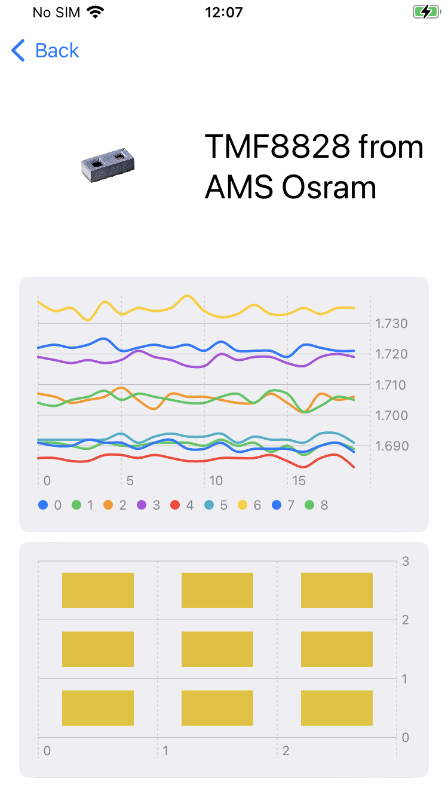
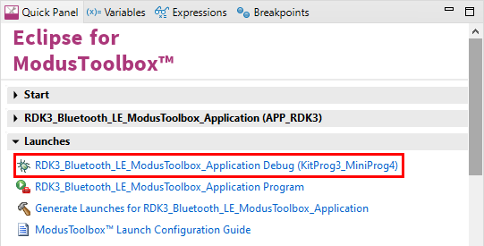

# RDK3 ModusToolbox Application (communication over BLE working with Android and iOS)

This software enables to collect the data from sensors (SensorFusion, CO2, AMS OSRAM TOF) and to send them over Bluetooth LE to a connected client.

Example with the iOS app: 
<p>

</p>

## Requirements

- [ModusToolbox® software](https://www.infineon.com/cms/en/design-support/tools/sdk/modustoolbox-software/) **v3.x** [built with **v3.1**]
- [RDK3](https://www.rutronik24.com/product/rutronik/rdk3/20820185.html)

- [ModusToolbox® software](https://www.infineon.com/cms/en/design-support/tools/sdk/modustoolbox-software/) **v3.2**: 

1. The [Python](https://www.python.org/) has to be installed manually on Windows OS.
2. Make sure the Python installation is added to the path variable. 
3. Use this command to install the [cysecuretools](https://pypi.org/project/cysecuretools/) package:

```
pip install cysecuretools
```

## Supported toolchains (make variable 'TOOLCHAIN')

- GNU Arm&reg; Embedded Compiler v11.3.1 (`GCC_ARM`) - Default value of `TOOLCHAIN`

## Documentation

### Bluetooth LE communication
The RDK3 implements a GATT server with one custom service.<br/>
The UUID of the service is: <b>76B6758B-FEDC-45F0-A5A4-4F49559BD71D</b>.<br/>
The service contains one custom characteristic with following properties:

    UUID: 9DC72F3C-9623-479B-B2E3-CA83316A0A0F
    Format: uint8[]
    Length: 495
    Properties: Write and Notify

The characteristic has one descriptor (UUID 2902) enabling to enable or disable the notifications.

In order to receive notification from the server (RDK3) the client (smartphone for example) needs to:

1. Change the MTU configuration (set it to 512 bytes)
2. Enable notification of the characteristic
3. Write [0] to the characteristic to get the list of available sensor (a bitmask)
4. RDK3 will answer with the list of available sensors (a uint32). Answer is sent from the RDK3 by sending a notification
5. Write [1] to the characteristic to active automatic push mode (the RDK3 will continuously sends the sensors values using notifications)

#### Format of the notifications
The notifications sends by the RDK3 always have the same format (see notification_fabric for more details).
- [0,1] uint16 (2 bytes) sensor id
    - 1: SHT4x
    - 2: BMP581
    - 3: SGP40
    - 4: SCD41
    - 5: TMF8828
    - 6: Battery monitor
    - 7: TMF8828 8x8 mode
    - 8: PASCO2
    - 0xA: DPS310
    - 0xB: BMI270
    - 0xC: BME688
    - 0xD: UM980 position
- [2] size of the data contained inside the notification (without sensor id and crc)
- [3.. size - 2] data (depends on the sensor)
- [size + 4 - 1] crc (at the moment always 0x3)


### Add another board/sensor
To add a new board / you will first have to add the driver for it. Since the RDK3 flash is limited, you might need to disable another board/sensor in order to fit in the flash.

See the file Makefile. Remove AMS_TMF_SUPPORT for example to free some space.
    
    # Add additional defines to the build process (without a leading -D).
    # Possible defines: 
    # AMS_TMF_SUPPORT => To enable the support of the time of flight board
    # BME688_SUPPORT => To enable the support of the BME688 sensor 
    # UM980_SUPPORT => To enable the support of the UM980 sensor
    DEFINES=AMS_TMF_SUPPORT BME688_SUPPORT UM980_SUPPORT

Inside the file rutronik_application.c, you will have to implement the logic (how to init and read the data of the sensor).

Inside the file notification_fabric.c, you will have to define how the data that have to be send over Bluetooth LE looks like. Choose a new sensor id to avoid collision with already implemented sensors.

## Commissioning
### The Provisioning of the RDK3

The CYB06447BZI-BLD53 device must be provisioned with keys and policies before being programmed.

Please follow the instructions of the [user manual](https://github.com/RutronikSystemSolutions/RDK3_Documents/blob/main/RDK3_user's_manual.pdf).

### Using the code example with a ModusToolbox™ IDE:

1. Import the project: **File** > **Import...** > **General** > **Existing Projects into Workspace** > **Next**.
2. Select the directory where **"RDK3_ModusToolbox_App"** resides and click  **Finish**.
3. Update the libraries using a **"Library Manager"** tool.
4. Select and build the project **Project ** > **Build Project**.

### Powering the RDK3 from the single-cell Li-ION/Li-PO battery

The RAB4-RTK adapter board needs to be powered from a +5V power supply source via Arduino Headers. If the USB-C cable is connected with RDK3 and PC, the power is already supplied without any additional setup. 

To make this demo portable and use it with Li-PO(or Li-ION) batteries, the OTG booster needs to be activated. This demo has a very simple method implemented which allows users to enable the boost mode of the [DIO59020](https://www.dioo.com/uploads/product/20210520/9fdd66c936d397ab75a4638578b09190.pdf) charger just by pressing a button USER BTN1. The 

- Connect the single-cell Li-PO or Li-ION battery, please respect the polarity. It would be best if the battery would have an internal protection circuit integrated.

- Switch the SW3 upwards to the "BATTERY" position.

- Mount the RAB4-RTK adapter board.

- Press and hold the button USER_BTN1 and then press and release a RESET Button. Notice if the GREEN LED D7 - "POWER" lights up.

- Release the USER_BTN1. The YELLOW blinking LED1 D8 indicates that the system is running and is ready for connection with a smartphone via Bluetooth LE. 

  NOTICE 1: this demo does not have power-saving and self-shutting down algorithms implemented yet. The switch SW3 must be switched down to the +5V/KitProg position if the development kit is not used. This is especially important if you are using batteries without the protection circuits integrated (never allow for the voltage of the battery to fall below 3 volts).

  NOTICE 2: The charging will not work if the boost mode is engaged. You need to restart the demo without pressing USER_BTN1.

  NOTICE 3: The battery charging current may be adjusted in code in `battery_booster.c`:

  ```c
      	/*The charging current depends on your battery used*/
      	dio_set_batt_current(CURR_VREF_101_8);
  ```


### Debugging

If you successfully have imported the example, the debug configurations are already prepared to use with a the KitProg3, MiniProg4, or J-link. Open the ModusToolbox™ perspective and find the Quick Panel. Click on the desired debug launch configuration and wait for the programming to complete and the debugging process to start.



## Legal Disclaimer

The evaluation board including the software is for testing purposes only and, because it has limited functions and limited resilience, is not suitable for permanent use under real conditions. If the evaluation board is nevertheless used under real conditions, this is done at one’s responsibility; any liability of Rutronik is insofar excluded. 


